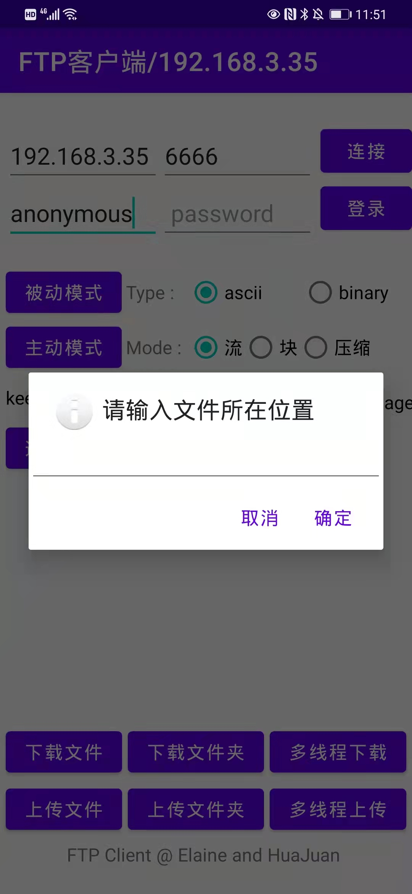

# FTP 实验文档

复旦大学 SOFT130023 计算机网络 project

19302010075 朱亦文 19302010021 张皓捷

贡献：各50%。

## demo视频链接

天翼云盘：https://cloud.189.cn/web/share?code=fm6v22iYfmqi（访问码：7ni7）
百度网盘：链接：https://pan.baidu.com/s/1PMqCVBmBTjOsd8TPPeaHTw 提取码：1wpv
OneDrive：https://1drv.ms/v/s!AiEar_HjbkFVhJkOUx2QYE2aKxBNlg?e=xUP4pI 密码：ftpdemo

## client

### 核心类属性

```java
private volatile String downloadDirectory;//ftp下载文件下载到哪个目录
private final Socket commandSocket;//控制连接
private volatile Socket dataSocket;//数据连接
//串联在commandSocket上的reader和writer对象
private final BufferedWriter commandSocketWriter;
private final BufferedReader commandSocketReader;
//记录客户端用的是主动模式还是被动模式
private enum PassiveActive {
    PASSIVE,
    ACTIVE
}
private volatile String serverAddress;//服务器的地址
private volatile int serverPort;//服务器的数据连接监听的端口
private volatile ServerSocket serverSocket;//主动连接时，客户端要在这个socket上监听并accept
//记录传输使用ASCII模式还是Binary模式
public enum ASCIIBinary {
    ASCII, BINARY
}
// 是否使用持久化数据连接
public enum KeepAlive {
    T,
    F
}
```

说明：由于涉及多线程操作，使用volatile修饰dataSocket等变量来保证可见性，即当一个线程修改共享变量后他会立即被更新到主内存中，其他线程读取共享变量时，会直接从主内存中读取。

默认情况下，client使用被动模式，传输使用Binary模式，不使用持久化数据连接。


### 指令实现

所有实现的指令简介和对应的响应码已经记录在interface.md文档中

#### USER & PASS

对应于MyFTPClientCore类的login()方法。

客户端控制连接写入"USER " + 用户名，若为匿名登录则无需密码。

若登录失败，则抛弃控制连接上的所有正在传输的数据，防止对下条指令造成干扰，其他指令同理。

#### PASV

客户端进入被动模式，服务器端新建并监听一个数据端口，控制连接返回服务器的ip地址和端口号。

客户端解析字符串，其中由于端口号为16bit，因此计算方式为port = p1*256 + p2

注：dataSocket应当在第一次传输文件时才通过保存下来的address和port打开，避免造成阻塞。

#### PORT

FTP文档中写道: The user-DTP must "listen" on the specified data port; this may be the default user port or a port specified in the PORT command.

port指令使得客户端进入主动模式。客户端先随机生成两个0-255的整数，循环尝试打开端口。

若打开成功，则获取本机地址，一并写给服务器端，此时如果原来有已经打开主动模式的数据连接监听端口，就将其关掉。

#### QUIT

客户端检查尚未关闭的所有控制连接和数据连接并关闭。

#### TYPE & MODE & STRU & KALI

这四条指令的实现方式基本相似，即通过控制连接的写入和读取来设置client类的相应属性。

#### RETR

判断是否使用持久连接模式与否建立数据连接。若为主动模式，则通过监听指定的端口accept得到一个dataSocket；若为被动模式，则通过原先保存的服务器端ip地址和端口号打开dataSocket

判断文件类型，ascii文件不支持持久连接，使用bufferedReader一行一行读取，连接关闭即传输结束；binary文件若为持久化连接，使用fileMeta记录需要读多少个字节，防止阻塞。

#### STOR

与retr类似，client在数据连接上写入，server读取。


#### 其他类方法

##### cloneClient()

用于优化策略，根据已有客户端信息克隆一个新的client，实现两个数据连接多线程传输。

##### lffr(String folderName)

列出服务器上名为folderName的文件夹内的所有文件，用于上传和下载文件夹。


### 界面交互逻辑

#### client 初始界面

<center class="half"><center>

客户端界面如图所示，用户输入主机名、端口号；用户名、密码进行连接与登录。右侧的单选按钮分别对应文件格式、传输模式、文件结构；左侧为主动被动模式选择，持久化数据连接选择和退出登录；页面下方两排按钮用于上传和下载。


#### 文件上传与下载

<center class="half"><center>


如左图，点击上传按钮，弹出输入框，需要用户输入相对于服务器根目录(即 /ftp_server)的文件/文件夹路径进行上传。

如右图，点击下载按钮，进入客户端文件系统目录，用户选中相应的文件/文件夹进行下载。

## Server

### ListeningThread：监听用户的控制连接请求并accept

核心方法：创建一个死循环，不断地accept用户的请求。当accept到用户的请求，并得到控制连接的Socket对象时，则新建一个线程，处理这个控制连接上的所有命令。

```Java
@Override
    public void run() {
        while (true) {//无线循环，监听用户的连接
            Socket clientCommandSocket;
            try {
                //accept用户的连接请求，并将得到的socket作为这个用户的控制连接！
                clientCommandSocket = serverSocket.accept();

                //创建处理用户请求的线程
                HandleUserRequestThread handleUserRequestThread = new HandleUserRequestThread(clientCommandSocket, rootPath);

                //线程开始运行
                handleUserRequestThread.start();
            } catch (IOException ignored) {
            }
        }
    }
```

### HandleUserRequestThread：处理一个控制连接上的命令的线程

核心方法：解析用户在控制连接上的输入，将其解析成Command对象，然后执行Command对象。

```java
@Override
    public void run() {
        //这个线程无线循环，监听用户的请求
        while (true) {
            try {
                //读取一行用户输入
                String commandLine = commandConnReader.readLine();

                //如果这里是null，就抛出IO异常。
                if (commandLine == null) {
                    throw new IOException();
                }

                //解析用户输入，获得命令对象
                AbstractCommand command = CommandFactory.parseCommand(commandLine);

                command.execute(this);
                
            } catch (CommandSyntaxWrongException commandSyntaxWrongException) {
                    writeLine(commandSyntaxWrongException.toString());
            } catch (IOException e) {//如果运行到这里，说明连接终端了
                closeAllConnections();
                break;
            }
        }

    }
```

### 命令模式

为每一种命令，比如RETR，STOR等命令创建了一个命令对象类，继承自抽象命令AbstractCommand。

```java
public abstract class AbstractCommand {
    
    protected final String commandType;
    protected final String commandArg;

    public abstract void execute(HandleUserRequestThread handleUserRequestThread) throws IOException;

    public AbstractCommand(String commandType, String commandArg) {
        this.commandType = commandType;
        this.commandArg = commandArg;
    }
}

```


用工厂模式，解析客户端在控制连接上的输入，获得Command对象

```Java
public class CommandFactory {

    /**
     * 根据控制连接上的一行（command），生产出对应的Command对象
     *
     * @param commandLine client在控制连接上输入的一行
     * @return 对应的Command对象
     */
    public static AbstractCommand parseCommand(String commandLine) throws CommandSyntaxWrongException;
}
```

### 指令实现

所有实现的指令简介和对应的响应码已经记录在interface.md文档中

#### USER & PASS

对应于USERCommand和PASSCommand。

对于USERCommand，如果用户时是anonymous，则直接显示登录成功；否则服务器在HandleUserRequestThread中记录下用户名，等待PASV命令。

对于PASSCommand，如果用户的密码不正确，或者用户根本就没有调用过USER命令，则显示未登录。反之则显示登录成功，将状态设置成已登录。

#### PASV

服务器端新建并监听一个数据端口，控制连接返回服务器的ip地址和端口号。

#### PORT

解析客户端发来的ip地址和端口号，在服务器上记录下来。等到需要传输文件时打开数据连接。

#### QUIT

服务端先给出【已经退出】的响应，然后关闭这个client对应的控制连接和数据连接。

#### TYPE & MODE & STRU & KALI

实现方式基本相似，设置对应的属性即可。

#### RETR

判断是否使用持久连接模式与否建立数据连接。在必要的时候打开数据连接：若为主动模式，则主动连接之前client发来的ip和port，得到数据连接。若为被动模式，则则通过监听指定的端口accept得到一个数据连接。

判断文件类型，ascii文件不支持持久连接，使用bufferedReader一行一行读取，连接关闭即传输结束；binary文件若为持久化连接，使用fileMeta向客户端表示需要读多少个字节。

#### STOR

与retr类似，client在数据连接上写入，server读取。

### 交互逻辑

<center class="half"><center>

服务器端界面如图所示，标题显示机器的ip地址，底部字符串为server在安卓手机上的根目录。

在横线中输入端口号，按下按钮启动服务器，若勾选“启用日志”按钮，则来自client的各项交互指令都会在上方空白处显示。

## 优化策略

主要优化了大量小文件的传输。

### 多线程并发传输小文件

在上传/下载文件夹时，使用两个线程并发地传输文件。比如一个文件夹folder内有200个文件，分别是file000,file001......file199。则使用一个线程传输file000~file099，用另一个线程传输file100~file199。两个线程并发地传输。**在文件大小比较小，且两部分文件的总大小比较均匀的情况下，这种优化策略的效果很好，几乎可以将传输时间缩短到原来的二分之一。**

在实现上，我们没有改变server的实现。而是在客户端，当需要多线程下载一个文件夹的时候，先获得文件夹里的所有文件的文件名，**然后直接“克隆”一个client对象**，将文件名分成两部分，分别由两个client（实际运行在一台机器上）并发下载，下载完以后关闭克隆出来的client。这种做法简化了实现，因为不需要修改server，使用了两个控制连接+两个数据连接。

```java
    public synchronized void retrieveFolderConcurrently(String folderAbsPathOnServer) throws FTPClientException {
        try {
            //克隆一个client对象
            MyFTPClientCore anotherClient;
            try {
                anotherClient = cloneClient();
            } catch (ServerNotFoundException e) {
                throw new FTPClientException(e);
            }

            //先用LFFR指令获得所有文件的列表
            List<String> serverFilenameList = lffr(folderAbsPathOnServer);

            //计算出每个文件在client上存放的物理位置
            List<String> clientFilenameList = Utils.getClientFilenames(downloadDirectory, serverFilenameList, folderName, folderAbsPathOnServer);

            //分割要下载的文件
            int sz = serverFilenameList.size();
            List<String> serverFilenameListA = serverFilenameList.subList(0, sz / 2);
            List<String> serverFilenameListB = serverFilenameList.subList(sz / 2, sz);
            List<String> clientFilenameListA = clientFilenameList.subList(0, sz / 2);
            List<String> clientFilenameListB = clientFilenameList.subList(sz / 2, sz);

            //异常列表，如果有并发的线程抛出了异常，就把异常放入这个列表中
            List<FTPClientException> exceptionList = new Vector<>();

            //下载任务，由两个线程分别执行
            class DownloadTask implements Runnable {

                final List<String> serverFilenameList;
                final List<String> clientFilenameList;
                final MyFTPClientCore clientCore;

                public DownloadTask(List<String> serverFilenameList, List<String> clientFilenameList, MyFTPClientCore clientCore) {
                    this.serverFilenameList = serverFilenameList;
                    this.clientFilenameList = clientFilenameList;
                    this.clientCore = clientCore;
                }

                @Override
                public void run(){
                    ......
                }
            }

            //开一个新线程，下载第二部分
            Thread t = new Thread(new DownloadTask(serverFilenameListB, clientFilenameListB, anotherClient));
            //线程启动
            t.start();

            //在原先的线程上下载第一部分
            new DownloadTask(serverFilenameListA, clientFilenameListA, this).run();
            try {
                t.join();
            } catch (InterruptedException ignored) {
            }

            //下载完了，关闭掉新开的client
            anotherClient.close();

            //如果有异常就抛出
            if (!exceptionList.isEmpty()) {
                throw exceptionList.get(0);
            }
        } catch (FTPClientException e) {
            discardAllOnCommandConnection();
            throw new FTPClientException(e);
        }
    }
```

最后的问题是，**如果要下载的文件夹中有一个文件比其他的文件都大出很多**，在这种最坏的情况下，这种做法的效率会退化到只用一个线程传输文件夹中所有文件的情况。

从理论上讲，当**部分1中文件的总大小和部分2中文件的总大小相等**时，这种做法的效果最好。由此便引出了一个问题：**能否设计一个算法用来把文件夹中所有文件分成部分1和部分2，使部分1的总大小与部分2的总大小尽可能接近？**这个问题的一个类似的版本是：**能否设计一个算法用来把文件夹中所有文件分成部分1和部分2，使部分1的总大小与部分2的总大小一样？**退化版本可以使用动态规划解决，但是也没有多项式时间复杂度的解法。因此我没有深入考虑这个问题，而只是简单地将文件名的集合一分为二，让两个client并发传输。因此如果正好两部分文件的总大小不太均匀，就会产生效率退化的问题，最极端的情况就是退化到只有一个线程来传输的效率。**但是TA给的small文件的大小都比较均匀，因此使用这种策略的优化效果比较显著。**

### Keep-Alive 持久化连接传输大量小文件

考虑两种策略，假设我们要传输一个具有10000个文件的文件夹，每个文件大小为50KB。

策略1：为每一个文件打开&关闭一个数据连接，即总共打开&关闭了10000个数据连接。

策略2：使用一个持久的数据连接传输10000个文件。

我们同时实现了这两种策略。实现了**KALI arg**指令确定是否使用持久连接传输。如果arg为T，则使用持久连接；如果arg为F，则不使用持久连接。

客户端有一个keep-alive的选项可以使用。


但是经过我的测试，不管是传输10000个大小为50KB的文件，还是传输10000个大小为1KB的文件，使用这两者传输所用的时间几乎没有区别。

**但是keep-alive并非完全没有意义。**因为我发现把数据连接的dataSocket关闭后，**端口并不会马上释放（似乎是大约20秒以后才会释放）**。如果需要传具有更多的小文件的文件夹（比如20000个小文件，30000个小文件，甚至100000个小文件），如果不使用keep-alive，而是反复打开/关闭新的数据连接的话，由于单个文件很小传输很快**，客户端（在被动模式下）或服务端（在主动模式下）的端口很快就会耗尽**，然后抛出异常。因此在上传上万个小文件的时候，还是应该打开keep-alive选项。
