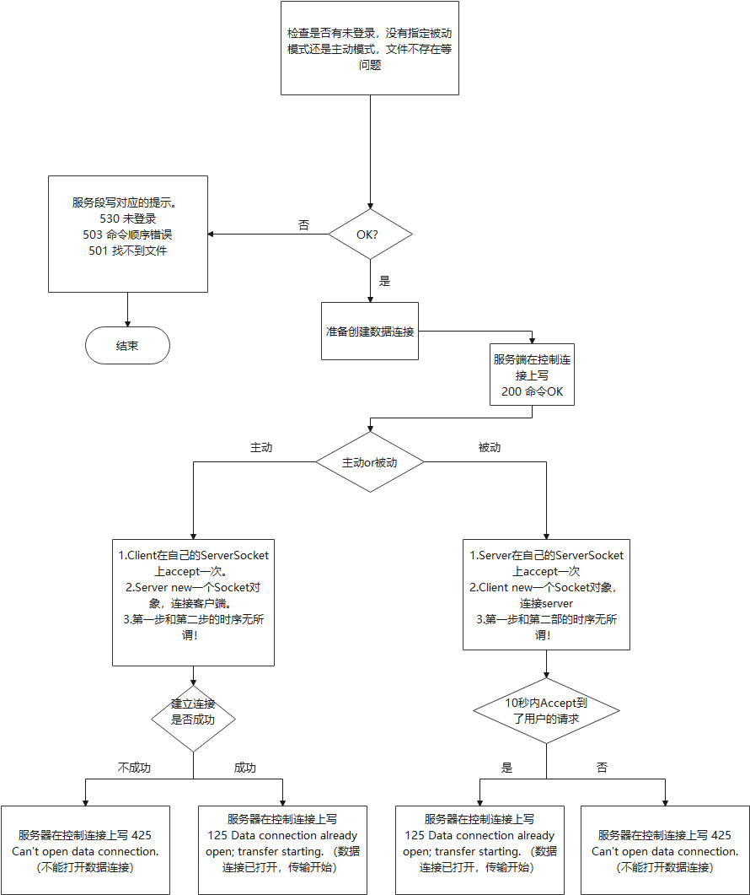

# 注意

每个命令的命令名（比如USER, PASV）必须全大写

命令和命令参数之间，响应码和响应信息之间，都用**一个空格**分开，比如

```
USER huajuan
530 没有登录成功
```

客户端向服务器发送命令，服务器向客户端发送响应，都是一行一行的，比如

```
USER huajuan
530 没有登录成功
```

每个都是一行。注意每行必须使用**<CRLF>**结尾，而不是<CR>或者<LF>。


**在一个控制连接上应该同时只能有一个命令执行，即在一个命令完全结束以后才能执行下一个命令。如果需要并发上传或下载，请使用多个控制连接。**


# 几个对于所有command都具有的response

## 500

语法错误，命令不能被识别

## 530

没有登录成功


# 命令：LFFR <foldername>

## 解释

这个命令其实在要求中没有，是我自己加的，主要的用途是递归地列出服务器上的一个文件夹中所有的文件及其路径，这样解决从服务器下载文件夹的时候，客户端只需要先调用LFFR获得文件夹中的所有文件，然后像服务器下载每一个文件即可，简化设计。

**LFFR=List Files in a FoldeR**

## 参数

foldername：服务器上的文件夹名

## 响应

1.如果文件夹不存在，或者文件夹很明显是个错误的参数，则在控制连接上返回

```
501 找不到文件夹
```

2.如果文件夹存在，则先在控制连接上输出一个

```
200 命令OK
```

然后递归地列出文件夹中所有的文件，最后一行后，跟一个<CRLF>表示结束了。

```
/pcs小程序/pcs_reg/.git/config<CRLF>
/pcs小程序/pcs_reg/.git/description<CRLF>
/pcs小程序/pcs_reg/.git/HEAD<CRLF>
/pcs小程序/pcs_reg/.git/hooks/applypatch-msg.sample<CRLF>
<CRLF>表示结束
```


# 命令：USER <username>

## 参数

username：用于登录的用户名

## 响应

### 230

用户登录成功，继续（即此时这个用户是没有密码的）

### 331

用户名OK，需要密码。


# 命令：PASS <pwd>

## 参数

pwd：用户登录的密码

## 响应

### 230

用户登录成功，继续


# 命令：PASV

## 参数

无

## 响应

### 227

227 Entering Passive Mode (h1,h2,h3,h4,p1,p2)

h1.h2.h3.h4 **是服务器的ip**

p1*256+p2 **是服务器打开的端口，客户端应该建立socket连接这个端口，作为数据连接**

## 行为

服务端在端口p1*256+p2上打开一个ServerSocket，但不进行accept

客户端记录下服务端的ip地址(h1,h2,h3,h4)及服务端的端口p1*256+p2，在后续STOR和RETR中使用。


# 命令：QUIT

## 参数

无

## 响应

### 221

服务器关闭控制连接，已注销


# 命令：PORT h1,h2,h3,h4,p1,p2

## 参数

h1,h2,h3,h4,p1,p2

## 解释

h1,h2,h3,h4 **客户端的ip**

p1*256+p2 **客户端应打开这个端口，由服务端来连接它**

## 响应

### 200

命令OK

## 行为

客户端记录下h1,h2,h3,h4,p1,p2，将来在准备执行STOR和RETR命令时，在p1*256+p2端口上打开ServerSocket，等待服务端连接

服务端也记录下h1,h2,h3,h4,p1,p2，将来在收到客户的STOR和RETR命令时（客户端有责任保证在向服务端发出STOR和RETR前已经在p1*256+p2上打开了ServerSocket），连接到客户端。


# 命令：TYPE <type>

## 参数

type=A **ASCII模式**

type=B **Binary模式**

## 响应

### 200

命令OK


# 命令：MODE <mode>

暂时不实现。默认流模式。


# 命令：STRU <structure>

暂时不实现。默认文件结构。


# 命令：RETR <pathname>

## 参数

pathname：要取回文件的路径名，比如

**在ASCII模式下**

```
RETR /novels/盗墓笔记.txt
```

**在Binary模式下**

```
RETR /softwares/office365.iso
```

## 传输数据格式

### ASCII模式

ASCII模式不支持并行传输优化。

1.用Scanner或者BufferedReader**按行**读取 盗墓笔记.txt ，在数据连接上按行发送，每行以<CRLF>结尾。

2.发送完毕后关闭数据连接

### Binary模式

为了完成optimization的15points，考虑使用两个数据连接并行传输数据。因此在每个part前需要有一个关于这个part的元信息。

1.先在每个数据连接上，以JSON的形式写一个PartMeta（Part的元信息），以CRLF结尾。以下是例子

```
{"compressed":"NOT_COMPRESSED","filename":"/hello.java","partID":0,"size":1024}<CRLF>
```

字段解释

compressed: 有COMPRESSED和NOT_COMPRESSED两种值，可能在传输大文件前先进行压缩是另一种优化传输时间的方式，因此这里先预留着，如果有时间的话试试看在传输前压缩大文件。

filename: 文件名，没什么好解释的

partID: 是数据的接收方收到这些以后，如何将好几个part组织成完整的文件。partID代表这些parts的顺序，比如partID为0的part就在partID为1的part的前面

size：是part的大小，而不是整个文件的大小

2.在每个数据连接上，传递对应的part的字节流，传完了关闭数据连接。

## 流程图




# 命令：STOR <pathname>

和RETE类似，客户端服务端反一下。注意如果需要上传文件夹，则应该是客户端用一个循环上传每个文件。


# 命令：NOOP

## 参数

无

## 响应

200 Command okay. （命令 OK）

